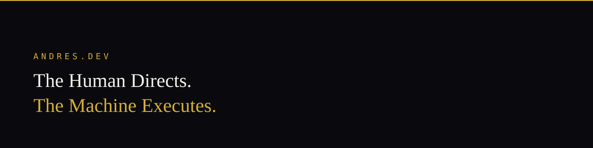

# Andrés López — AI Product Orchestrator

I translate real operational problems into clear, useful, and verified digital products through human-directed, AI-assisted engineering.

**Portfolio:** [andres-dev-portfolio.netlify.app](https://andres-dev-portfolio.netlify.app/)  
**Methodology:** Spec-Driven Development (SDD) · RDD · TDD  
**Operating Principle:** The Human Directs. The Machine Executes.  
**Location:** Colombia · Open to remote opportunities  

---

## Operating Philosophy

> *"Anyone can generate code; understanding real operational logic cannot be faked. My systems work because I live their operation every day on the ground and know exactly how they must execute."*

I direct AI across domain modeling, product definition, UI/UX exploration, and software delivery. I write explicit Given/When/Then specifications, guide agent exploration across decoupled architectures, and require automated test verification before accepting any code.

---

## Product Systems & Case Studies

Explore live case studies, architectural decisions, and rejected alternatives on my portfolio:  
👉 **[andres-dev-portfolio.netlify.app](https://andres-dev-portfolio.netlify.app/)**

* **Campus Access Control & Operations:** Multi-gate physical security platform solving peak-hour bottlenecks and guard shift handovers through decoupled domain logic and continuous access verification.
* **Offline-First Security Patrols:** Field application for guards in zero-connectivity posts, designed with single-tap local logging and automatic background synchronization upon network recovery.
* **AI-Directed Development Workflow (SDD):** Formal specification contracts, multi-agent adversarial review, and multi-layer verification before merge.

---

## Architecture & Technical Direction

| Focus | Disciplines & Tools |
| --- | --- |
| **Product & UI/UX** | Operational domain modeling, interaction design, accessible web standards, single-action simplicity |
| **Methodology** | Spec-Driven Development (SDD), Receipt-Driven Development (RDD), Test-Driven Development (TDD) |
| **Architecture** | Clean Architecture, Domain-Driven Design (DDD), Decoupled Systems, Strict Grants & Schemas |
| **Continuous Learning** | JavaScript, TypeScript, Flutter, React, PostgreSQL, SQLite, Docker, CI/CD |

---

Colombia. Built with web standards. Verified before shipping.
